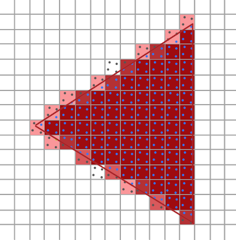
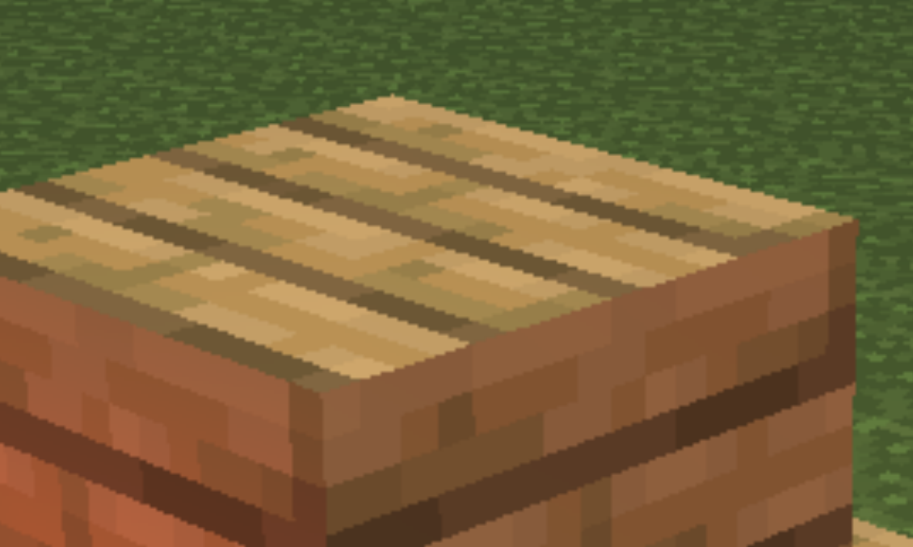

# 我的世界

## 项目介绍以及实现结果

《我的世界》是一款 3D 的第一人称沙盒游戏，所呈现的世界并不是华丽的画面与特效，而是注重在游戏性上面。

玩家在游戏中做着「建设」与「破坏」两件事，但是透过像乐高一样的积木来组合与拼凑，轻而易举的就能制作出小木屋、城堡甚至城市，但是若再加上玩家的想像力，空中之城、地底都市都一样能够实现。

本次期末项目将使用 OpenGL 复刻《我的世界》。

## 开发环境以及使用到的第三方库

使用`Vcpkg`管理第三方库

```
glfw3:x64-windows
glad:x64-windows
glm:x64-windows
imgui:x64-windows
assimp:x64-windows
stb:x64-windows
freetype:x64-windows
rapidjson:x64-windows
```

## 实现功能列表

### Basic

- Camera Roaming
- Simple lighting and shading
- Texture mapping
- Shadow mapping (discarded)
- Model import

### Bonus

- Sky Box
- Display Text
- Complex Lighting
  - G-Buffer and Deferred Shading (_discarded_)
  - SSAO (_discarded_)
  - Custom AO
  - Multiple Light Sources
  - Custom Block Lighting (doing)
- Anti-Aliasing
- Selective Block Rendering
- Instancing
- Face Culling
- Blending
- Fog View
- Gravity System and Collision Detection (todo)
- Map generation base on Perlin Noise (doing)
- Map System
- Add or Remove Block

## 对实现的功能点做简单介绍

### Camera Roaming

封装了一个 Camera 类

- 支持自定义视角轨迹


- 支持自由视角


### Light

#### 多光源

整个场景有一个平行光和多个点光源


主要实现方法就是在着色器中计算多个点光源并将其叠加起来

```clike
uniform PointLight pointLights[NR_POINT_LIGHTS];

void main() {
	vec3 norm = normalize(Normal);
	vec3 viewDir = normalize(viewPos - FragPos);
	// 计算定向光源
	vec3 result = CalcDirLight(dirLight, norm, viewDir);
	// 计算点光源
	for (int i = 0; i < pointCount; i++) {
		result += CalcPointLight(pointLights[i], norm, FragPos, viewDir);
	}

	FragColor = vec4(result, 1.0);
}
```

#### 点光源的衰减

对于单个点光源的计算，按照以下的公式实现了距离的衰减


主要的效果为光在近距离时亮度很高，但随着距离变远亮度迅速降低，最后会以更慢的速度减少亮度。


这里通过根据不同的光照强度定义点光源的常数项、一次项和二次项来实现。

```clike
struct PointLight {
    vec3 position;

    float constant;
    float linear;
    float quadratic;

    vec3 ambient;
    vec3 diffuse;
    vec3 specular;
};
```

#### 自定义光强

由于简单的光源对于一些遮挡住的情况不能正确显示，这里参考了我的世界中的光照实现，把光强分为 16 个等级。

首先从最上方注入垂直光源


然后对其进行 16 次迭代扩散


这样每个方块的表面都会有一个光强值。

这里暂时只实现了垂直光的注入，扩散和点光源的注入有待实现。


### Shadow

对于阴影的实现，我们考虑了很多种方法。

首先是传统的阴影映射，通过光源视角的映射来绘制阴影。然而使用这种方法对于一些透明或者不规则的方块，如玻璃、火把、树叶、水面等没有办法正确实现他们的阴影，因此我们抛弃了这一种方法。

从图中可以看到，玻璃是半透明的方块，草是部分透明的方块，这些方块的阴影的实现都会很奇怪。


然后，我们通过 G 缓冲实现了延迟着色法，并且使用了**屏幕空间环境光遮蔽(Screen-Space Ambient Occlusion, SSAO)**的技术，用了屏幕空间场景的深度而不是真实的几何体数据来确定遮蔽量。


实验发现这种方法带来的性能下降比较多，明显的一点是帧数大幅度下降了，而且其效果也一般般，某些地方还是不可以正确显示。

然后，我们了解了我的世界中环境阴影的实现，实现了一种自定义的环境光遮蔽


根据边上的方块的数量，对其进行光线的衰减。

这里通过着色器中的内建变量`gl_VertexID`来分别渲染正方体的不同面的遮挡效果。

```clike
if (gl_VertexID >= 0 && gl_VertexID < 4) {
  lightColor = vec4(lightColor.xyz * aoFront[gl_VertexID % 4] ,lightColor.a);
}
if (gl_VertexID >= 4 && gl_VertexID < 8) {
  lightColor = vec4(lightColor.xyz * aoBack[gl_VertexID % 4] ,lightColor.a);
}
if (gl_VertexID >= 8 && gl_VertexID < 12) {
  lightColor = vec4(lightColor.xyz * aoLeft[gl_VertexID % 4] ,lightColor.a);
}
if (gl_VertexID >= 12 && gl_VertexID < 16) {
  lightColor = vec4(lightColor.xyz * aoRight[gl_VertexID % 4] ,lightColor.a);
}
if (gl_VertexID >= 16 && gl_VertexID < 20) {
  lightColor = vec4(lightColor.xyz * aoBottom[gl_VertexID % 4] ,lightColor.a);
}
if (gl_VertexID >= 20 && gl_VertexID < 24) {
  lightColor = vec4(lightColor.xyz * aoTop[gl_VertexID % 4] ,lightColor.a);
}
```

在没有开启 AO 之前，一些被遮挡的方块的光线不能正确显示，而使用之后就可以看出来正常很多，效果对比：

| 未开启 AO                                  | 开启 AO                                                                  |
| ------------------------------------------ | ------------------------------------------------------------------------ |
|  |  |

由于 AO 只有在一开始生成方块的时候需要计算，因此性能还是挺好的。

对其进行进一步的改进得到更自然的阴影渲染


但是由于分区块渲染的原因，有些部分的 AO 渲染有待优化。

### Sky Box


天空盒通过立方体贴图实现


通过六个面的填空图像合成一个天空盒，在渲染的时候，我们需要天空盒显示在所有物体的后面，一个方法是一开始先渲染天空盒，但是在一般情况下，天空盒只是有少部分是可见的。因此这里使用了提前深度测试来丢弃片段，最后才渲染天空盒。

在着色器中，把天空盒的 w 分量调成`1`

```clike
void main() {
    TexCoords = aPos;
    vec4 pos = projection * view * vec4(aPos, 1.0);
    gl_Position = pos.xyww;
}
```

然后需要把深度测试的方式改成`GL_LEQUAL`，表示在片段深度值小于等于缓冲区的深度值时通过测试，这样天空盒就会被认为是最后面的

```c++
glDepthFunc(GL_LEQUAL);
this->skyShader->Use();
glBindVertexArray(skyboxVAO);
glActiveTexture(GL_TEXTURE0);
glBindTexture(GL_TEXTURE_CUBE_MAP, this->skyBox->ID);
glDrawArrays(GL_TRIANGLES, 0, 36);
glBindVertexArray(0);
glDepthFunc(GL_LESS);
```

最后把深度测试方式调回默认的`GL_LESS`

### Block Render

在我的世界里面，绝大多数对象都是由**方块+纹理**组成的，因此纹理是这里比较重要的一个部分。

#### 自定义方块

由于游戏中方块对象比较多，而且每个方块又有着各自的纹理以及渲染方式，因此我们将方块的数据抽取到`json`文件中，通过读取`json`文件来获取方块的纹理、类型和渲染方式等信息。

```json
 [
  {
    "id": 0,
    "name": "air",
    "type": 0,
    "render": 12,
    "textures": [],
    "colors": [],
    "animation": 0,
    "light": 0
  },
  {
    "id": 1,
    "name": "stone",
    "type": 2,
    "render": 2,
    "textures": ["stone.png"],
    "colors": [[0.8, 0.8, 0.8, 1.0]],
    "animation": 0,
    "light": 0
  },
  {
    "id": 2,
    "name": "grass_block",
    "type": 2,
    "render": 3,
    "textures": ["grass_block_side.png", "grass_block_top.png"],
    "colors": [[0.57, 0.73, 0.37, 1.0], [0.61, 0.45, 0.37, 1.0]],
    "animation": 0,
    "light": 0
  },
  {
    "id": 3,
    "name": "dirt",
    "type": 2,
    "render": 12,
    "textures": ["dirt.png"],
    "colors": [],
    "animation": 0,
    "light": 0
  },
   ...
]
```

只需要修改这个文件，就可以轻松地添加新的方块。

```c++
class BlockData final {
public:
    BlockId Id;
    std::string Name;
    BlockType Type;
    RenderType Render;                  // 渲染类型
    std::vector<Texture2D> Textures;    // 材质
    std::vector<glm::vec4> Colors;      // 颜色
    uint8_t Light;                      // 自身亮度
    uint8_t Animation;                  // 动画速度 (0-5)
};
```

这样，在场景中只需提供方块 ID 以及位置，就可以轻松地进行渲染

```c++
// 渲染火把
renderer->DrawBlock(BlockId::Torch, torchPosition);
```

每个方块都有方块类型和渲染类型的信息，这些信息决定了碰撞、光照以及纹理的渲染

```c++
enum class BlockType : uint8_t {
    None = 0,           // 无实体
    Liquid = 1,         // 液体
    Solid = 2,          // 固体
    Face = 3,           // 单面
    TransSolid = 4,     // 透明固体
    TransFace = 5,      // 透明单面
};

enum class RenderType : uint8_t {
    None = 0,              // 不渲染
    ThreeTexture = 1,       // 三纹理方块(上、四周、下)
    NoiseTexture = 2,       // 噪声 + 颜色
    SideTexture = 3,        // 上下噪声，四周纹理
    CenterCrossTexture = 4, // 中心交叉纹理
    TorchTexture = 5,       // 火把
    FireTexture = 6,        // 火焰
    CustomTexture = 7,      // 六面自定义方块 (前后左右上下)
    DirCustomTexture = 8,   // 具有方向的方块 （前、侧边、上下）
    DoorTexture = 9,        // 门
    GlassTexture = 10,      // 玻璃
    LiquidTexture = 11,     // 液体表面
    OneTexture = 12,         // 单纹理方块
    OffsetTexture = 13,
    OffsetSideTexture = 14,
};
```

然后根据类型进行渲染

```c++
  switch (type) {
    case RenderType::OneTexture: // 单纹理方块
        if (colors.size() > 0) {
            shader->SetInteger("hasColor", true);
            shader->SetVector4f("material.color", colors[0]);
        }
        textures[0].Bind();
        glBindVertexArray(this->quadVAO);
        glDrawElementsInstanced(GL_TRIANGLES, 36, GL_UNSIGNED_INT, 0, count);
        break;
    case RenderType::ThreeTexture: // 三纹理方块(上、四周、下)
        textures[1].Bind();
        glBindVertexArray(this->quadVAO);
        glDrawElementsInstanced(GL_TRIANGLES, 24, GL_UNSIGNED_INT, 0, count);

        textures[0].Bind();
        glBindVertexArray(this->topVAO);
        glDrawElementsInstanced(GL_TRIANGLES, 6, GL_UNSIGNED_INT, 0, count);

        textures[2].Bind();
        glBindVertexArray(this->bottomVAO);
        glDrawElementsInstanced(GL_TRIANGLES, 6, GL_UNSIGNED_INT, 0, count);
        break;
     // ...
  }
```

目前暂时支持我的世界中 20+种方块的渲染


#### 动态纹理

对于一些动态贴图的方块，我们也做了支持

火焰


水面


海晶灯


主要的实现方法是直接划分贴图中的数据，提取出多张纹理

```c++
for (int i = 0; i < count; i++) {
    Texture2D texture;
    texture.Image_Format = format;
    texture.Internal_Format = format;
    texture.Generate(sWidth, sHeight, image + (nrChannels * sWidth * sHeight) * i);
    textures.push_back(texture);
}
```

然后在渲染的时候，根据`json`文件中的速度信息，选择不同的纹理进行渲染。

```c++
if (block->data.Animation != 0) {
  frame = (this->renderFrame / block->data.Animation) % block->data.Textures.size();
}
```

### Model

对于我的世界中一些生物，我们直接加载模型进行展示


### Display Text

对于文字的渲染，这里使用了`Freetype`这个库

其实现原理是首先加载字体文件，然后创建 `128` 个英文字符的纹理，因此这里的文字渲染只支持英文和标点。

```c++
// 初始化字体
void ResourceManager::InitFont(const GLchar* path) {
  // ...

  for (GLubyte c = 0; c < 128; c++) {
    // ... 创建字体纹理
    Characters.insert(std::pair<GLchar, Character>(c, character));
  }
  // ...
}
```

然后渲染的时候，绑定指定的纹理即可。

```c++
void SpriteRenderer::RenderText(std::string text, glm::vec2 position, GLfloat scale, glm::vec4 color) {
    fontShader->Use();
    fontShader->SetVector4f("textColor", color);
    fontShader->SetInteger("text", 0);
    glActiveTexture(GL_TEXTURE0);
    glBindVertexArray(ResourceManager::fontVAO);
    std::string::const_iterator c;
    for (c = text.begin(); c != text.end(); c++) {
        // ...
        glBindTexture(GL_TEXTURE_2D, ch.TextureID);
        glBindBuffer(GL_ARRAY_BUFFER, ResourceManager::fontVBO);
        glBufferSubData(GL_ARRAY_BUFFER, 0, sizeof(vertices), vertices);
        glBindBuffer(GL_ARRAY_BUFFER, 0);
        glDrawArrays(GL_TRIANGLES, 0, 6);
        position.x += (ch.Advance >> 6) * scale;
    }
    glBindVertexArray(0);
    glBindTexture(GL_TEXTURE_2D, 0);
}
```

这样就可以实现了：


需要注意的是，对于字体的边缘部分，我们需要通过着色器对其进行抛弃。

```clike
#version 330 core
in vec2 TexCoords;
out vec4 color;

uniform sampler2D text;
uniform vec4 textColor;

void main() {
    if (texture(text, TexCoords).r < 0.1) {
        discard; // 抛弃边缘透明部分
    }
    vec4 sampled = vec4(1.0, 1.0, 1.0, texture(text, TexCoords).r);
    color = textColor * sampled;
}
```

### Anti-Aliasing

由于这个游戏中都是一些方块组成的，因此有些地方的锯齿现象比较明显，因此使用了抗锯齿的技术。



这里的反锯齿主要是通过多次采样渲染，在`glfw`中，只需要在创建窗口的时候调节`GLFW_SAMPLES`采样数并且开启多采样即可。

```c++
glfwWindowHint(GLFW_SAMPLES, 4);
glEnable(GL_MULTISAMPLE);
```

这样就可以得到更平滑的边缘：

未开启抗锯齿



开启反锯齿


### Selective Block Rendering

选择性可视区块渲染

由于引入地图生成之后，在场景中可能回同时存在很多方块，可能会达到百万的数量级。如果对于所有方块都一一绘制，那样将会浪费很多带宽。因此，我们根据摄像机的位置，只渲染摄像机所看到的方块。

首先，我们将地图空间分为若干个区块，每个区块中包含着$n\times n \times n$个方块。

```c++
// 获取区块索引
glm::i32vec3 getRegionIndex(glm::vec3 pos) {
    if (pos.x < 0) pos.x = pos.x - RENDER_SIZE;
    if (pos.y < 0) pos.y = pos.y - RENDER_SIZE;
    if (pos.z < 0) pos.z = pos.z - RENDER_SIZE;
    return glm::i32vec3(pos) / glm::i32vec3(RENDER_SIZE);
}

// 获取区块中的位置
glm::vec3 getRelaPostion(glm::vec3 pos) {
    pos = glm::i32vec3(pos) % glm::i32vec3(RENDER_SIZE);
    if (pos.x < 0) pos.x = RENDER_SIZE + pos.x;
    if (pos.y < 0) pos.y = RENDER_SIZE + pos.y;
    if (pos.z < 0) pos.z = RENDER_SIZE + pos.z;
    return glm::vec3(pos);
}
```

对于区块和方块之间的映射，我们设计两个函数，以原点为中心分割出固定大小的区块。

使用三个 Map 的数据结构将地图数据存储起来

`map<int, map<int, map<int, RenderRegionData*>>> renderRegion`

然后就可以计算区块的可视性：

```c++
bool SpriteRenderer::isVisable(float x, float y, float z) {
    x += this->viewFront.x * 3;
    y += this->viewFront.y * 3;
    z += this->viewFront.z * 3;
    glm::vec3 regionPos = (glm::vec3(x, y, z)) * glm::vec3(RENDER_SIZE) - this->viewPos;
    float regionDis = abs(regionPos.x) + abs(regionPos.y) + abs(regionPos.z);
    // 抛弃远距离
    if (regionDis > 450) return false;
    glm::vec3 viewAngle = glm::normalize(regionPos) * this->viewFront;
    float viewCos = viewAngle.x + viewAngle.y + viewAngle.z;
    // 抛弃视锥之外
    return viewCos > 0.8;
}
```

由于传入的区块的位置是在中心点，如果直接按这个点进行计算，有可能造成摄像机过了这个中心点之后就判断这个区块不可见，因此需要把区块的中心点加上摄像机的方向的偏移，使得判断点在于摄像机视线中区块的最远处。


然后计算摄像机和区块点的距离以及余弦值，将过远的区块抛弃，将摄像机的正方向和摄像机到区块点的余弦值，也就是视线的夹角大于一定值的区块抛弃。

### Instancing

实例化数组

在我的世界里面，存在大量重复的方块，如果一个个分别绘制的话，无疑会占用大量的带宽，每帧数十万的渲染函数调用会严重影响性能，因此使用了实例化数组来优化大量重复方块的场景。

```c++
glEnableVertexAttribArray(0);
glVertexAttribPointer(0, 3, GL_FLOAT, GL_FALSE, 8 * sizeof(float), (void*)0);
glEnableVertexAttribArray(1);
glVertexAttribPointer(1, 3, GL_FLOAT, GL_FALSE, 8 * sizeof(float), (void*)(3 * sizeof(float)));
glEnableVertexAttribArray(2);
glVertexAttribPointer(2, 2, GL_FLOAT, GL_FALSE, 8 * sizeof(float), (void*)(6 * sizeof(float)));
// 实例化数组
glBindBuffer(GL_ARRAY_BUFFER, this->instanceVBO);
glEnableVertexAttribArray(3);
glVertexAttribPointer(3, 4, GL_FLOAT, GL_FALSE, sizeof(glm::vec4), (void*)0);
glVertexAttribDivisor(3, 1);
```

在定义立方体的顶点、法向量、纹理之后，附加一个实例化数组，用来传递方块的位置信息。

实例化的核心就在于`glVertexAttribDivisor`，告诉了 OpenGL 如何更新实例化数组。

在渲染的时候，一次性将所有的顶点位置都传递过去。

```c++
glBindBuffer(GL_ARRAY_BUFFER, this->instanceVBO);
glBufferSubData(GL_ARRAY_BUFFER, 0, sizeof(glm::vec4) * count, &position[0]);
glBindBuffer(GL_ARRAY_BUFFER, 0);
```

因为我们在外面还需要一些旋转或者缩放的操作，因此不能直接在顶点位置加上偏移，必须自己构建一个平移变换矩阵叠加到现有的变换之上：

```clike
#version 330 core
layout (location = 0) in vec3 aPos;
layout (location = 1) in vec3 aNormal;
layout (location = 2) in vec2 aTexCoords;
layout (location = 3) in vec4 aOffset;

void main() {
		mat4 offsetModel = mat4(1.0, 0.0, 0.0, 0.0,
													0.0, 1.0, 0.0, 0.0,
													0.0, 0.0, 1.0, 0.0,
													aOffset.xyz, 1.0) * model;
    vec4 position = offsetModel * vec4(aPos, 1.0);
  	gl_Position = projection * view * position;
}
```

使用实例化数组之后，即使同时渲染近十万的方块，性能也没有明显的下降，依旧十分流畅。


### Face Culling

面剔除

在方块世界中，我们最多同时可以看到一个方块的三个面，因此有超过 50%的面不处于视图之内并且照样渲染了出来，因此需要使用面剔除来优化性能。

在 OpenGL 中，我们可以将顶点按特定的顺序排列来使用面剔除


简单来说，就是所有逆时针定义的三角形就会被处理为正向三角形，如上图的右边所示。

因此，需要对立方体的 VBO 和 VEO 重新排布，使其满足这个需求

```c++
float verticesQuad[] = {
  // 正面
  0.5f, -0.5f,  0.5f,  0.0f,  0.0f,  1.0f, 1.0f, 1.0f, // 右下角
  0.5f,  0.5f,  0.5f,  0.0f,  0.0f,  1.0f, 1.0f, 0.0f, // 右上角
  -0.5f,  0.5f,  0.5f,  0.0f,  0.0f,  1.0f, 0.0f, 0.0f, // 左上角
  -0.5f, -0.5f,  0.5f,  0.0f,  0.0f,  1.0f, 0.0f, 1.0f, // 左下角
  // 后面
  // ...
};

unsigned int indicesQuad[] = {
  0, 1, 2, 2, 3, 0,
  4, 5, 6, 6, 7, 4,
  8, 9, 10, 10, 11, 8,
  12, 13, 14, 14, 15, 12,
  16, 17, 18, 18, 19, 16,
  20, 21, 22, 22, 23, 20
};
```

在下面的效果图中可以看到，当我们走入仙人掌的内部的时候可以看到前面两个面就会处于背面状态是没有显示的。事实上，在游戏中我们也不会进入一个方块的内部，因此这两个面的渲染时不必要的。


但是对于一些透明方块来说，所有的面都需要渲染，这时候可以临时禁用面剔除

```c++
glDisable(GL_CULL_FACE);
glDrawElementsInstanced(GL_TRIANGLES, 6, GL_UNSIGNED_INT, 0, count);
glEnable(GL_CULL_FACE);
```

### Blending

混合是实现物体透明度的一种技术。

像树叶、草和花这种完全透明的方块，只需要将透明部分完全丢弃即可

| 树叶                                                                     | 草                                         | 花                                         |
| ------------------------------------------------------------------------ | ------------------------------------------ | ------------------------------------------ |
|  |  |  |

```clike
if (objectColor.a < 0.1) {
  discard;
}
```

在着色器判断 a 通道的值将透明的直接丢弃。

在我的世界中、水面、染色玻璃等物品都是具有透明度的方块，与完全透明的方块不同的是，透明度不能直接丢弃，必须叠加渲染

| 染色玻璃                                                                 | 水面                       |
| ------------------------------------------------------------------------ | -------------------------- |
|  |  |

使用`GL_BLEND`来启用混合

```c++
glEnable(GL_BLEND);
glBlendFunc(GL_SRC_ALPHA, GL_ONE_MINUS_SRC_ALPHA);
```

混合按照以下的公式实现


按照透明度，将两者的颜色叠加起来

绘制半透明的有以下的原则：

1. 先绘制所有不透明的物体。
2. 对所有透明的物体排序。
3. 按顺序绘制所有透明的物体。

如果没有按照正确的顺序进行渲染，就会出现以下的结果：

| 错误的渲染顺序                                                           | 正确的渲染顺序                             |
| ------------------------------------------------------------------------ | ------------------------------------------ |
|  |  |

但是在场景中排序物体是一个很困难的技术，我们这里使用了几个规则来保证了渲染的顺序

首先在区块中，我们需要从远处的区块开始渲染，由于区块是 Map 结构，是存在顺序的

`map<int, map<int, map<int, RenderRegionData*>>> renderRegion`

因此只需要按照指定的顺序渲染区块即可

```c++
// 是否正向渲染
bool fx = this->viewFront.x < 0;
bool fy = this->viewFront.y < 0;
bool fz = this->viewFront.z < 0;
// 渲染区块
```

对于区块中的每个方块，我们采用了 `List` 的数据结构存储渲染顺序

```c++
// 渲染区块数据
struct RenderRegionData {
    vector<BlockInst> blockData;
    list<int> blockIndex;
    bool requireUpdate;
    BlockCell blocks[RENDER_SIZE * RENDER_SIZE * RENDER_SIZE];
};
```

在将方块放入渲染区块的时候，判断方块的渲染类型，如果是带有透明度的方块，则将其放到列表的后面，否则直接放入列表的前端。

```c++
RenderRegionData** region = &this->renderRegion[instX.first][instY.first][instZ.first];
int index = (*region)->blockData.size();
if (data.Type == BlockType::TransSolid || data.Type == BlockType::TransFace || data.Type == BlockType::Liquid) {
	(*region)->blockIndex.push_back(index);
} else {
	(*region)->blockIndex.push_front(index);
}
```

结合上面两种规则，可以最大限度地保证渲染顺序的正确性，但是对于多个透明方块的情况，还是不能正确显示。


因此，对于方块中的位置，还需要根据当前摄像机的视线进行排序，从远到近进行渲染。

```c++
struct BlockInst {
    BlockData data;
    vector<glm::vec4> position;
    int dir;
};
```

### Fog View

迷雾

在我的世界中，当我们看向远处的物体时，就会有一层迷雾，可以更真实地表示距离以及隐藏远处的方块


具体的实现也不难，在顶点着色器中根据摄像机离方块的距离计算出浓雾的因子，将其缩放到 0-1 的范围内

```clike
float cameraDistance = distance(viewPos, vec3(position));
fogFactor = 1 - pow(e, -pow(cameraDistance * 0.01, 2));
```

然后再片段着色器中使用`mix`将物体的实际颜色和雾的颜色进行混合即可。

```clike
 FragColor = mix(lightColor * objectColor, vec4(0.6, 0.8, 0.8, 1.0), fogFactor);
```

### Gravity System and Collision Detection

重力系统和物理碰撞

// TODO

### Map generation

地图生成取决于地图种子，相同的地图种子将生成相同的地形。

首先使用地图种子来初始化一个32位无符号整型的伪随机数生成器，然后使用伪随机数生成器来生成出生点坐标、噪声种子等。

```c++
std::default_random_engine engine;
std::uniform_int_distribution<uint32_t> rand;
uint32_t seed;
```

然后使用多个不同参数的基于Perlin噪声的Octave噪声来生成地图，噪声主要用于生成高度图、密度图、概率。

```c++
OctaveNoise<PerlinNoise> depthNoise1;
OctaveNoise<PerlinNoise> depthNoise2;
OctaveNoise<PerlinNoise> thicknessNoise;
OctaveNoise<PerlinNoise> grassNoise;
OctaveNoise<PerlinNoise> flowerNoise;
OctaveNoise<PerlinNoise> treeNoise;
```

地图生成的主要流程如下：

1. 生成地形高度图：使用`depthNoise1`、`depthNoise2`噪声组合生成高度，对较低或较高的高度进行矫正。
2. 生成地形层厚度图：使用`thicknessNoise`生成泥土厚度。
3. 填充方块：填充基岩、圆石、泥土，同时为地表填充草方块。
4. 生成花草：使用`grassNoise`、`flowerNoise`生成花草。
5. 生成树木：使用`treeNoise`生成树木。

### Map System

加载和存储地图

// TODO

### Add or Remove Block

方块的动态添加与删除。

添加或删除方块首先需要确定当前摄像机所面对的方块。可以利用相机的Position向量及Front向量求出，由于Front向量是表示相机当前朝向的标准化向量，故可以通过在Position向量上累加Front向量来求出相机视线上的点的坐标。在累加求出每个坐标之后，对这些坐标取整，得到对应的游戏坐标，判断该坐标是否存在方块，若存在，则该方块即为摄像机面对的方块，否则继续进行坐标向量累加。

此外在添加方块时，为了确定放置的位置，还要判断出当前面对的是目标方块的哪个面。同样需要利用相机的Position向量及Front向量。由于游戏坐标位于各个方块的中心点，且方块的边长为1个单位坐标，故方块各个面的位置坐标均可求出：

```c++
float border[6] = { lookingAt.y + 0.5, lookingAt.y - 0.5, lookingAt.z + 0.5, lookingAt.x + 0.5, lookingAt.z - 0.5, lookingAt.x - 0.5 };
```

对于方块的每组平行面，同一时刻只能看到两个平行面中的一个，可以利用Front向量的符号确定看到的是哪个平行面。然后利用直线参数方程求出相机视线与该平行面A所在平面的交点，若交点的另外两维坐标处于对应平行面所在的平面之间，则可以确定A为当前朝向的面。

在添加方块时将方块放置到当前看向的面所朝向的方块位置，如下图的标记所示：

|                   放置前                   |                   放置后                   |
| :----------------------------------------: | :----------------------------------------: |
|  |  |

```c++
position = glm::vec3((int)camera->Position.x, (int)camera->Position.y, (int)camera->Position.z);
lookingAt = caculateLookingAt();
updateNewBlockPosition();
if (renderer->GetBlock(lookingAt).Id != BlockId::Air) {
	renderer->SetShowBlock(lookingAt, newBlockDirection);
}
else {
	renderer->HideShowBlock();
}
```

## 遇到的问题和解决方案

遇到的问题和解决方法都在上面了。

渲染部分主要是阴影、光照、混合以及超大数量的方块渲染。

## 小组成员分工

陈荣真 - 负责方块渲染部分

陈思琦 - 负责重力与碰撞检测，摄像机跟随与人物渲染

陈统盼 - 负责方块元信息加载，方块的放置和破坏

陈秀嘉 - 负责项目架构和地图系统

